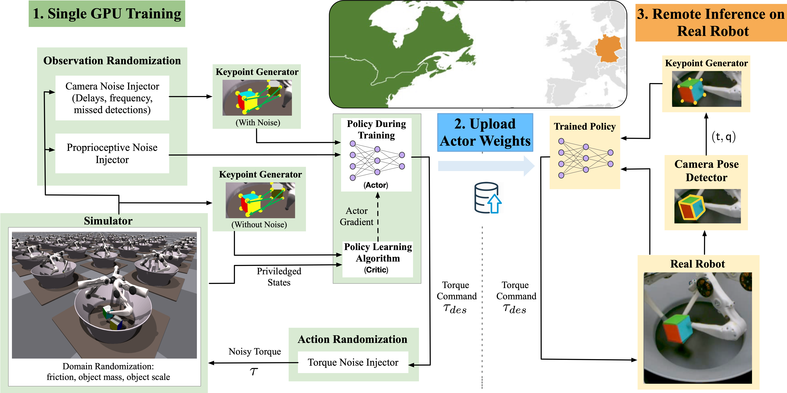

# Transferring Dexterous Manipulation from GPU Simulation to a Remote Real-World TriFinger

<iframe width="800" height="450" src="https://www.youtube.com/embed/Bd0sZ980PeM?controls=0" title="Presentation" frameborder="0" allow="accelerometer; autoplay; clipboard-write; encrypted-media; gyroscope; picture-in-picture" allowfullscreen></iframe>

## Abstract

We present a system for learning a challenging dexterous manipulation task involving moving a cube to an arbitrary 6-DoF pose with only 3-fingers trained with NVIDIA's IsaacGym simulator. We show empirical benefits, both in simulation and sim-to-real transfer, of using keypoints as opposed to position+quaternion representations for the object pose in 6-DoF for policy observations and in reward calculation to train a model-free reinforcement learning agent. By utilizing domain randomization strategies along with the keypoint representation of the pose of the manipulated object, we achieve a high success rate of 83% on a remote TriFinger system maintained by the organizers of the Real Robot Challenge.

The paper can be found [here](https://openreview.net/forum?id=faXIE2kpfrv). The codebase for the project will be released soon, and a visual representation of our setup can be found below:

